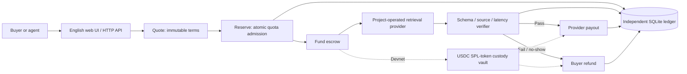
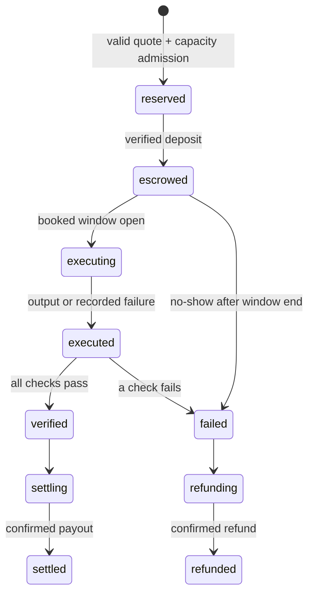

# Architecture and trust model

## Code boundaries

- `config.mjs`: new-root state constraints, official Devnet RPC, fixed Circle mint and own port.
- `store.mjs`: SQLite sessions, quotes, reservations, consumed transaction signatures and signed-payment outbox. Session secrets and state never appear in static assets.
- `engine.mjs`: terms, inventory, state transitions, ownership checks, money conservation, execution lock and interrupted-work recovery.
- `provider.mjs`: independent retrieval computation over three public documentation summaries. No existing Commit endpoint or paid service call.
- `solana.mjs`: Devnet genesis/mint check, deposit builder, confirmed-receipt verification, project-controlled vault key and persisted signed payout.
- `index.mjs`: same-origin HTTP, HttpOnly session cookie, CSRF checks, bounded JSON bodies, strict static-file allowlist.
- `web/app.mjs`: UI stages and wallet signing. Buyer private keys stay in the wallet extension; server vault keys stay in `.state/`.

## State machine

Quotes are separate immutable offers. Reservation consumes inventory under `BEGIN IMMEDIATE`; reusing a consumed quote returns its existing reservation. Pending/unfulfilled reservations conservatively consume quota for overlapping windows. Settled/refunded reservations release it. Single-process action locks prevent simultaneous fund, execute or finish on the same order. `verify` is synchronous, with no asynchronous gap; repeated calls return the persisted result.

## Money and evidence invariants

- Six-decimal integer accounting; no float arithmetic for transferred amounts.
- Quoted total = quantity × 50,000; the depositor must transfer exactly this amount in the canonical transaction.
- Passing order: provider receives total, buyer refund zero. Failing order: buyer receives total, provider zero.
- Simulation balances and final reservation status are committed in one database transaction.
- A unique global signature table prevents a confirmed deposit receipt from funding two reservations.
- Payout transaction bytes/signature are persisted before network broadcast. On retry, the same signature is reconciled or resent; it is not replaced with a fresh payment.
- If a payout expires and its outcome is unknown, payment remains paused for reconciliation. The app does not invent a second payout.
- Terms, output and checks are hash-bound. Local event hashes include the previous hash. Chain deposit/payout memos bind the reservation and terms; payout additionally includes the verification proof hash.

Hash linkage supports consistency checks, not independent attestation. An operator with database and key access can rewrite local history or divert vault funds. The current evidence is not a decentralized oracle.

## Devnet payment flow

1. Server generates a fresh per-reservation vault wallet in its private `.state/` directory.
2. Buyer signs the canonical transaction: create destination ATA if needed, `TransferChecked` on official Circle Devnet USDC, reservation/terms memo.
3. The browser sends the signed transaction to the official Devnet RPC. The server independently fetches the confirmed parsed transaction.
4. Server validates successful transaction, buyer signer, buyer ATA, vault ATA, mint, decimals, amount, memo and exact destination net increase.
5. After verification, server signs an SPL transfer from the vault. A separate new operator wallet pays Devnet transaction fees. Provider payout uses the new provider public key; refund uses the original reserved buyer, never a caller-supplied destination.
6. Only confirmed/finalized success produces `settled` or `refunded` and an Explorer link.

Standard SPL token accounts do not enforce this application’s SLA. The design is project-operated custody; a PDA escrow program and verifier authorization policy remain future work.

## Isolation

No old repo was cloned into the new repo, no old `.git` or remotes were copied, and no deployment context was imported. Existing code was fetched read-only through GitHub; an illustration was copied from the original local asset. Existing Commit domains, earlier contracts, databases, wallets and deployment scripts are not runtime dependencies.

## Prototype operational limits

Use one instance with persistent SQLite and keys. This is not a horizontally scaled service. Browser-cookie ownership has no account recovery or multi-device identity. There is no background scheduler: users/agents trigger execution and no-show refunds. Unfunded reservations have no early cancellation flow and remain outstanding; each session can hold at most three unfinished orders. Do not repeatedly create orders if a deposit has an unknown outcome.

Do not discard the state volume during a payment; it contains both vault keys and outbox signatures. Duplicate or accidental extra direct token deposits, rent reclamation, public abuse protection and manual reconciliation tools are not product features. No mainnet or commercial custody is supported. A security audit, provider independence, external demand validation and a reviewed PDA design would be required before a production rollout.
